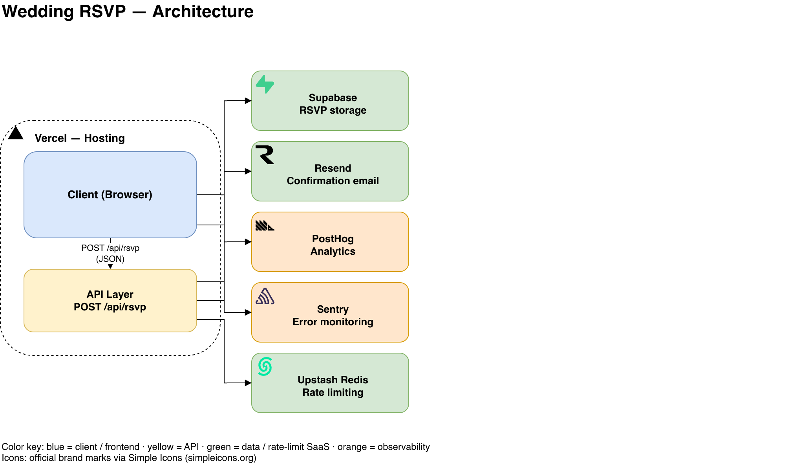

# 💍 Wedding Invitation & RSVP Platform


A production-quality wedding invitation and RSVP web application built as a portfolio showcase. Guests receive a personalised digital invitation, confirm attendance, and submit dietary preferences — all in their preferred language.

**Live audience:** International wedding guests  
**Wedding date:** Saturday, 14 November 2026  
**Venue:** Kirana Estate, Jl. Raya Sayan, Sayan, Ubud, Gianyar, Bali, Indonesia

---

## ✨ Features

| Category | Details |
|----------|---------|
| **i18n** | English (default) · Bahasa Indonesia · Japanese — switch live via header, persisted in `localStorage` |
| **RSVP** | 10-field validated form (attendance, guests, name, email, age, address, dietary restrictions, message) |
| **Page Transitions** | Awwwards-style full-screen charcoal curtain with staggered couple monogram + SplitText name reveal |
| **Animations** | Motion v12 scroll-driven reveals, countdown digit-flip, timeline beam, botanical SVG system |
| **Maps** | Google Maps iframe embed for Kirana Estate, Ubud with greyscale-to-colour hover |
| **Observability** | PostHog session recording · Sentry real-time error tracking |
| **Rate limiting** | Upstash Redis on `/api/rsvp` |
| **Email** | Resend transactional confirmation on every submission |
| **DB** | Supabase PostgreSQL — RSVP data persisted and visible in admin dashboard |
| **Admin** | Basic-Auth protected dashboard with Recharts attendance charts and CSV export |
| **Security** | Strict CSP, security headers, CSV-injection-safe export, constant-time admin auth |
| **Testing** | Vitest unit tests (7 files) + Playwright E2E (10 spec files) covering form flow, validation, API, responsive, language switching |

---

## 🛠 Tech Stack



<sub>Editable source: [`docs/diagrams/architecture.drawio`](docs/diagrams/architecture.drawio) — open with [diagrams.net](https://app.diagrams.net) or the VS Code "Draw.io Integration" extension.</sub>

**How it works:** a guest fills out `RsvpForm.tsx` on the homepage, which `POST`s to the `/api/rsvp` route handler. The route checks an Upstash Redis rate-limit gate (10 requests / 60s per IP), inserts the validated row into Supabase Postgres, and — without blocking the response — asks Resend to send a localized confirmation email. The admin dashboard (`/admin`, gated by Basic Auth in `middleware.ts`) reads the same Supabase table and renders it as a sortable table plus Recharts attendance/participant charts. Every page view is sent to PostHog, and client- and server-side errors are captured by Sentry.

| Layer | Stack |
|-------|-------|
| **Framework** | Next.js 16 (App Router, TypeScript) · React 19 |
| **Styling / UI** | Tailwind CSS v4 · shadcn/ui · Radix UI · Base UI · Lucide React |
| **Animation & Scroll** | Motion v12 (formerly Framer Motion) · Lenis v1.3 · tsParticles |
| **Forms & Validation** | react-hook-form + Zod (locale-aware error messages) |
| **Backend / API** | Next.js Route Handlers (`/api/rsvp`, `/api/video/scroll`) · Supabase PostgreSQL · Upstash Redis rate limiting |
| **Email** | Resend (transactional confirmation, HTML templated per locale) |
| **Observability** | PostHog (session recording & analytics) · Sentry (client / server / edge error tracking) |
| **Admin** | Recharts (attendance visualisations) · Basic-Auth middleware |
| **Testing & Tooling** | Vitest + Testing Library (unit) · Playwright (E2E) |
| **Fonts** | Playfair Display (display) · Lora (serif) · Geist Sans (sans) |

### SaaS integrations

| Service | Role |
|---------|------|
| **Supabase** | PostgreSQL — RSVP storage |
| **Resend** | Transactional confirmation emails |
| **PostHog** | Session recording & analytics |
| **Sentry** | Real-time error monitoring |
| **Upstash Redis** | API rate limiting |
| **Vercel** | Hosting (Hobby plan) |

---

## 📁 Project Structure

```
wedding-rsvp/
├── docs/blueprint.md               Master spec
├── CLAUDE.md                       AI development rules
├── sentry.client.config.ts         Sentry init — browser
├── sentry.server.config.ts         Sentry init — Node runtime
├── sentry.edge.config.ts           Sentry init — edge runtime
├── src/
│   ├── middleware.ts                Basic Auth guard for /admin
│   ├── instrumentation.ts           Sentry register() / onRequestError hooks
│   ├── app/
│   │   ├── layout.tsx                Root layout — fonts, lang, providers
│   │   ├── page.tsx                  Home — hero, nav panels, RSVP form
│   │   ├── providers.tsx             PostHog init + pageview tracking
│   │   ├── story/page.tsx            Our Story — intro + timeline
│   │   ├── details/page.tsx          Details — schedule, venue, map
│   │   ├── admin/                    Admin dashboard (Basic-Auth gated)
│   │   │   ├── page.tsx
│   │   │   ├── RsvpTable.tsx           Sortable table + CSV export
│   │   │   └── RsvpCharts.tsx          Recharts attendance charts
│   │   └── api/
│   │       ├── rsvp/route.ts           RSVP submission endpoint
│   │       └── video/scroll/route.ts   Byte-range video proxy (Supabase Storage)
│   ├── components/
│   │   ├── Header.tsx / Footer.tsx     Site chrome
│   │   ├── NavPanels.tsx               3-panel navigation grid
│   │   ├── RsvpForm.tsx                Multi-field animated form
│   │   ├── HomeVideoScroller.tsx        Cinematic pinned-scroll video hero (Home)
│   │   ├── DetailsVideoScroller.tsx    Same pattern, Details page
│   │   ├── VideoScroller.tsx           Shared scroll-video engine
│   │   ├── TimelineBeam.tsx            Story timeline with scroll beam
│   │   ├── Countdown.tsx               SSR-safe digit-flip countdown
│   │   ├── Monogram.tsx                Couple initials monogram mark
│   │   ├── Preloader.tsx               Initial load screen
│   │   ├── ParticlesBackground.tsx     tsParticles ambient background
│   │   ├── PageCurtain.tsx             Page transition overlay
│   │   ├── TransitionLink.tsx          Curtain-aware Link component
│   │   ├── LanguageSwitcher.tsx        ID / EN / JA toggle
│   │   ├── Trans.tsx                   Inline i18n text helper
│   │   └── ui/                         shadcn/ui + custom primitives
│   ├── context/
│   │   ├── LangContext.tsx             i18n context + useLang() hook
│   │   ├── LenisContext.tsx            Smooth-scroll provider
│   │   └── TransitionContext.tsx       Page transition state machine
│   └── lib/
│       ├── i18n.ts                     Translation strings (ID / EN / JA)
│       ├── schema.ts                   Zod RSVP validation (locale-aware)
│       ├── supabase.ts                 Supabase admin client
│       ├── upstash.ts                  Rate limiter
│       ├── email.ts                    Resend confirmation email builder
│       ├── media.ts                    Supabase Storage / Runway / Unsplash asset helper
│       └── utils.ts                    Shared helpers
├── vitest.config.ts / vitest.setup.ts  Unit test runner config
└── e2e/                               Playwright specs (+ helpers.ts)
```

---

## 🚀 Getting Started

### Prerequisites

- Node.js 20+
- Docker (running `npm run dev` starts a local Supabase Postgres stack via the Supabase CLI)
- A `.env.local` file with the keys listed below

### Install & run

```bash
npm install
npm run dev      # starts local Supabase (Docker) + Next.js dev server
```

Open [http://localhost:3000](http://localhost:3000).

Stop the local Supabase stack when done:

```bash
npm run db:stop
```

### Environment variables

Create `.env.local` at the project root:

```env
# Site
NEXT_PUBLIC_SITE_URL=http://localhost:3000

# Supabase
NEXT_PUBLIC_SUPABASE_URL=
NEXT_PUBLIC_SUPABASE_ANON_KEY=
SUPABASE_SERVICE_ROLE_KEY=
SUPABASE_DB_PASSWORD=
NEXT_PUBLIC_MEDIA_BASE_URL=

# Resend
RESEND_API_KEY=
EMAIL_FROM=

# PostHog
NEXT_PUBLIC_POSTHOG_KEY=
NEXT_PUBLIC_POSTHOG_HOST=https://us.i.posthog.com

# Sentry
NEXT_PUBLIC_SENTRY_DSN=
SENTRY_AUTH_TOKEN=
SENTRY_ORG=
SENTRY_PROJECT=

# Upstash Redis
UPSTASH_REDIS_REST_URL=
UPSTASH_REDIS_REST_TOKEN=

# Admin dashboard (Basic Auth)
ADMIN_USERNAME=
ADMIN_PASSWORD=
```

---

## 🧪 Testing

**Unit tests** (Vitest + Testing Library) cover i18n, schema validation, email templating, and hooks:

```bash
npm test              # run once
npm run test:watch    # watch mode
npm run test:coverage # with coverage report
```

**E2E tests** (Playwright) cover the full RSVP flow, API, admin dashboard, responsiveness, and language switching:

```bash
# Install browsers (first time)
npx playwright install --with-deps

# Run all E2E tests
npx playwright test

# Run with UI
npx playwright test --ui

# Specific spec
npx playwright test e2e/rsvp-form.spec.ts
```

E2E tests run against the dev server (`http://localhost:3000`). Supabase and Resend calls are mocked via `page.route()`.

---

## 🌐 i18n

The default language is **Bahasa Indonesia** — the primary guest audience.

| Locale | Label | Notes |
|--------|-------|-------|
| `id` | ID | Default; Zod validation messages also in Indonesian |
| `en` | EN | English |
| `ja` | JA | Japanese |

Translations live in `src/lib/i18n.ts` as flat key/value objects. The `useLang()` hook (from `src/context/LangContext.tsx`) provides `t(key)` and `setLocale()` to any client component. Language choice is persisted in `localStorage` under the key `"wedding-lang"`.

---

## 🎬 Page Transitions

Navigating between pages triggers a full-screen `wedding-charcoal` curtain that rises from the bottom, briefly reveals the couple's monogram with a staggered letter animation and their names in SplitText style, then slides off the top to reveal the destination page. The implementation is in:

- `src/context/TransitionContext.tsx` — state machine (idle → covering → revealing → idle)
- `src/components/PageCurtain.tsx` — the visual overlay driven by `useMotionValue`
- `src/components/TransitionLink.tsx` — drop-in `<a>` replacement for nav and CTA links

---

## 📋 RSVP Form Fields

| # | Field | Type | Required |
|---|-------|------|----------|
| 1 | `attend_or_absent` | enum: attend / absent | ✅ |
| 2 | `number_of_participants` | integer 1–10 | If attending |
| 3 | `name` | string max 100 | ✅ |
| 4 | `email_address` | email | ✅ |
| 5 | `age` | integer 0–120 | — |
| 6 | `postcode` | string | — |
| 7 | `address` | string max 300 | — |
| 8 | `phone_number` | string | — |
| 9 | `dietary_restrictions` | string max 500 | — |
| 10 | `message` | string max 1000 | — |

---

## 🔒 Security

- **Admin auth** — `src/middleware.ts` gates `/admin/:path*` with HTTP Basic Auth, comparing credentials with a constant-time `safeEqual` to avoid timing attacks. In production, missing `ADMIN_USERNAME`/`ADMIN_PASSWORD` hard-fails with `503` rather than allowing open access.
- **CSP & security headers** — `next.config.ts` sets a hand-built Content-Security-Policy (allowlisting only the Supabase media origin, PostHog ingest, and Google Maps `frame-src`), plus `X-Frame-Options: DENY`, HSTS, and a disabled `X-Powered-By` header.
- **CSV-injection-safe export** — the admin dashboard's CSV export (`RsvpTable.tsx`) prefixes any cell starting with `=`, `+`, `-`, or `@` to prevent Excel/Sheets formula injection from guest-submitted data.
- **Rate limiting** — Upstash Redis on `/api/rsvp` (10 req / 60s per IP), keyed off `x-vercel-forwarded-for` / `x-forwarded-for`.

---

## 🛡 Architecture Notes

- **No `/rsvp` route** — the form is inline on the homepage (`#rsvp` anchor)
- **No registry feature** — intentionally excluded per project spec
- **Scroll reset** — Lenis `scrollTo(0, { immediate: true })` on every pathname change prevents scroll-position bleed between pages
- **Video delivery** — `/api/video/scroll` proxies Supabase Storage with `HEAD`/ranged `GET` support, working around a CDN quirk with spaces in storage paths

---

## 🏗 Deployment

Deploy to Vercel:

```bash
vercel --prod
```

All environment variables must be set in the Vercel project settings. Supabase RLS policies deny all direct access; the API route writes exclusively through the service-role key.

---

*Built with ❤️ as a portfolio project demonstrating full-stack Next.js 16, real-time observability, and production-grade UI/UX.*
